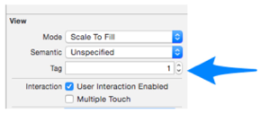

## The Tag Properties
Take a look at the Main.storyboard and the ViewController.swift. The ViewController already contains the storyline and possible answers as Strings.
Make a note of the tags of the two buttons. topButton has a tag of 1 and bottomButton has a of tag 2

When the topButton or bottomButton is pressed, it will trigger the IBAction buttonPressed(). The “sender” in the brackets refers to the button that triggered the IBAction.

Because this IBAction is linked up to both the topButton and the bottomButton, we will need the tag property to distinguish who triggered the IBAction.

We can do this by checking sender.tag, if sender.tag == 1, the user must have pressed the topButton and if sender.tag == 2 then the user must have pressed the bottomButton.
